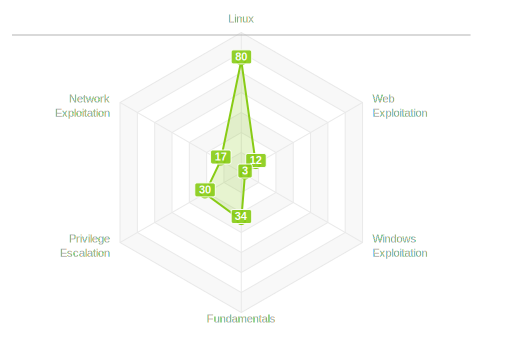

##  

             
             
             
             
             
             
            

 
 ✩✩✩✩✩✩✩✩✩✩✩✩✩✩✩✩✩✩✩✩✩✩✩✩✩✩✩✩✩✩✩✩✩✩✩✩✩✩✩✩✩✩✩✩✩✩✩✩✩✩✩✩✩✩✩✩✩✩✩✩✩✩✩✩✩✩✩✩✩
 
✩    *I'm Ayoub Elouarzazi, a 21-year-old passionate individual hailing from Rabat, Morocco. I
've always been captivated by the world of cyber security and ethical hacking. It's more than just a
 hobby for me; it's an obsession that drives my every step.*

✩    *Growing up in Rabat, I was naturally drawn to technology and its inner workings. As I delved deeper
 into the digital realm, I discovered the fascinating world of cyber security. The thought of
 protecting networks and systems from malicious actors intrigued me immensely.*

✩    *With each passing day, my curiosity grew stronger, pushing me to expand my knowledge and skills in
 this dynamic field. I dedicate a significant amount of time to staying updated on the latest
 industry trends, emerging technologies, and cutting-edge hacking techniques. After all, staying one
 step ahead is crucial in the ever-evolving landscape of cyber threats.*

 ✩✩✩✩✩✩✩✩✩✩✩✩✩✩✩✩✩✩✩✩✩✩✩✩✩✩✩✩✩✩✩✩✩✩✩✩✩✩✩✩✩✩✩✩✩✩✩✩✩✩✩✩✩✩✩✩✩✩✩✩✩✩✩✩✩✩✩✩✩

 ✩✩✩✩✩✩✩✩✩✩✩✩✩✩✩✩✩✩✩✩✩✩✩✩✩✩✩✩✩✩✩✩✩✩✩✩✩✩✩✩✩✩✩✩✩✩✩✩✩✩✩✩✩✩✩✩✩✩✩✩✩✩✩✩✩✩✩✩✩
 
 
 
